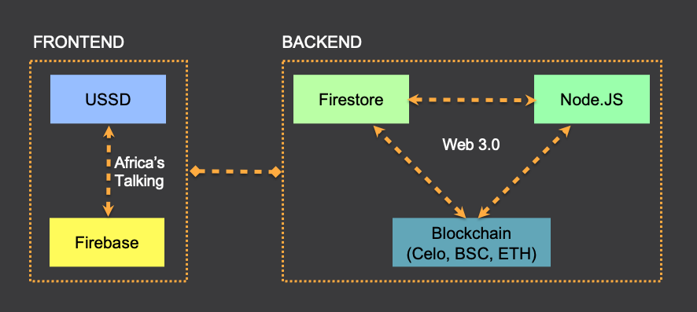

# 🙋 Welcome to Kotani Pay

Welcome to the Kotani Pay source code repository!&#x20;

Kotani Pay is a stablecoin to fiat on-ramp and off-ramp service. The service is offered as an end to end API (Application Programming Interface) to enable other businesses to integrate and also as a USSD (Unstructured Supplementary Service Data) application for end-users to convert stablecoins to local fiat.

The Kotani Pay API enables Blockchain protocols, decentralized applications and FinTech services to connect to traditional payment systems to enable cash out to bank and mobile money accounts. Kotani Pay offers a simple integration experience.

Majority of Blockchain protocols require internet access and installation of additional mobile applications or wallets. This limits their adoption locking out the users who are set to benefit the most. Kotani Pay through the API makes access to these protocols and their tokens possible without the need of an Internet connection.

At the moment, you can onlyuse our "app" via USSD. In the near future, we will also release mobile apps and a web version.&#x20;

Some of the groundbreaking features on the USSD app include**;** Create Account, Send Money, Deposit Funds, Withdraw Cash, My account and Short Message Service (SMS) Response Option&#x20;

**Create Account**: Users can easily create their accounts by accessing a USSD code eg \*_483\*_354# on their GSM or Smartphone device. The user will be issued with an account mapped to their phone number complete with their seed key phrase, Blockchain private key, Blockchain public key and PIN. Send Money: Users can send currencies that live on the Celo Blockchain to other users.This transaction is performed from a USSD command interface or a social messaging interface (WhatsApp, Telegram).&#x20;

**Deposit Funds**: Users can receive Blockchain based currencies to their accounts from cash deposits on popular mobile financial Services e.g. M-Pesa.&#x20;

**Withdraw Cash**: Users can withdraw cash through local mobile financial services from the Celo Blockchain using their USSD command interfaces or social messaging interfaces.&#x20;

**My account**: Access all information related to the user account: Check balance, check deposit and withdrawal history

**SMS response Option**: Users receive delivery reports and transaction status on SMS.&#x20;

Additional Features (in the works!)&#x20;

**Buy Airtime**: Users can buy cell phone minutes on popular telecommunications networks (Airtime) using their Celo Blockchain based currencies.&#x20;

**Loans and Savings**: Access save cUSD and cGold using USSD command interfaces or social messaging interfaces. Creditors can lend cUSD and cGold based on users credit history.&#x20;

**Pay bills and Buy Goods**: Provide USSD off-ramp for utilities, goods and services payments. Supported Blockchain Protocols: Celo Supported Payment Systems: M-Pesa, MTN MoMo, Airtel, Zoona, Equitel Supported USSD Platforms: Africa’sTalking, Black Box

### Documentation

Follow the instructions [here](guides/getting-started-with-the-api/local-environment/) to get a development environment set up.

### Repo Structure

[Kotani Pay API](https://github.com/KotaniLabs/kotanipay\_API/tree/main/v2) : The Kotani Pay API enables Blockchain protocols, decentralized applications and FinTech services to connect to traditional payment systems such as mobile money.

[Kotani Swap](https://github.com/KotaniLabs/kotaniswap):  The Kotani DeFi network is a decentralized mobile money service owned by Kotani Pay, wallet users and agents. Kotani Swap is the Automated Market Maker (AMM) of the Kotani DeFi Network.

### **Contributing**

Feel free to jump on the Kotani Pay train. Improvements and contributions are highly encouraged! 🙏👊 See the contributing guide for details on how to participate.

Contributing Guide

**Reporting an Issue**

If you're about to raise an issue because you think you've found a problem with the stack, or you'd like to make a request for a new feature in the codebase, or any other reason, please read this first. The GitHub issue tracker is the preferred channel for bug reports, feature requests, and submitting pull requests, but please respect the following restrictions:

1. Please search for existing issues. Help us keep duplicate issues to a minimum by checking to see if someone has already reported your problem or requested your idea.
2. Please be civil. Keep the discussion on topic and respect the opinions of others. See our Code of Conduct.

**Reporting Bugs**

A bug is a demonstrable problem that is caused by the code in the repository and can be reported in the form of a new issue.&#x20;

Guidelines for bug reports:

1. Use the GitHub issue search — check if the issue has already been reported.
2. Check if the issue has been fixed — look for closed issues in the current milestone or try to reproduce it using the latest develop branch.

A good bug report or a new issue shouldn't leave others needing to chase you up for more information. Be sure to include the details of your environment and relevant tests that demonstrate the failure.

**Feature Requests**

Feature requests are welcome. Before you submit one be sure to have:

1. Use the GitHub search and check the feature hasn't already been requested.
2. Take a moment to think about whether your idea fits with the scope and aims of the project.

Remember, it's up to you to make a strong case to convince the project's leaders of the merits of this feature. Please provide as much detail and context as possible, this means explaining the use case and why it is likely to be common.

**Pull Requests**

We suggest creating a Pull Request with “WIP” (Work In Progress) in the title and let us know when it’s ready to review in the comments. If the Pull Request fits with the scope and aims of the project we will merge it with our current repo.


If you are new to Github, see [About Pull Requests](https://help.github.com/en/github/collaborating-with-issues-and-pull-requests/about-pull-requests) for more information.


**Code of Conduct**

All communication and contributions to the Kotani Pay project are subject to the [Kotani Pay Code of Conduct](https://kimothobrian.gitbook.io/kotanipay/fundamentals/code-of-conduct).

Ask Questions, Find Answers, Get in Touch

Telegram, Medium, Twitter, Facebook

**Open Source Tools**

* [Celo Dapp Kit](https://docs.celo.org/developer-guide/dappkit)&#x20;
* [Truffle](https://trufflesuite.co)
* [Open Zeppelin](https://openzeppelin.com/contracts/)
* [Postman](https://www.postman.com/)
* [Uniswap V2 Factory](https://docs.uniswap.org/protocol/V2/reference/smart-contracts/factory)
* [VS Code](https://code.visualstudio.com/)

**Open Source Frameworks**

* [Node JS](https://www.geeksforgeeks.org/introduction-to-node-js/)

License

All packages are licensed under the terms of the MIT License. MIT License Copyright (c) 2021 Kotani Pay Ltd. Permission is hereby granted, free of charge, to any person obtaining a copy of this software and associated documentation files (the "Software"), to deal in the Software without restriction, including without limitation the rights to use, copy, modify, merge, publish, distribute, sublicense, and/or sell copies of the Software, and to permit persons to whom the Software is furnished to do so, subject to the following conditions: The above copyright notice and this permission notice shall be included in all copies or substantial portions of the Software. THE SOFTWARE IS PROVIDED "AS IS", WITHOUT WARRANTY OF ANY KIND, EXPRESS OR IMPLIED, INCLUDING BUT NOT LIMITED TO THE WARRANTIES OF MERCHANTABILITY, FITNESS FOR A PARTICULAR PURPOSE AND NONINFRINGEMENT. IN NO EVENT SHALL THE AUTHORS OR COPYRIGHT HOLDERS BE LIABLE FOR ANY CLAIM, DAMAGES OR OTHER LIABILITY, WHETHER IN AN ACTION OF CONTRACT, TORT OR OTHERWISE, ARISING FROM, OUT OF OR IN CONNECTION WITH THE SOFTWARE OR THE USE OR OTHER DEALINGS IN THE SOFTWARE.

**User stories**

Cash transfer Payments

1. Juma, a refugee from Kenya enrolls to a stablecoin cash transfer program by Mercy Corp by signing up to a Kotani Pay account&#x20;
2. To do this he dials _483_354#, receives a prompt asking him for general KYC information, and after signing up gets a confirmation message&#x20;
3. He dials the code again and receives a menu&#x20;
4. He chooses the withdraw cash option, then claims his daily Universal Basic Income payment which in the background converts his stablecoin assets to fiat in his mobile money account.&#x20;
5. He immediately receives a payment to his M-Pesa mobile money account

Gig work Payments:

1. Jannete, an online freelancer has just received her pay in stablecoin for the work she did for Corsali MicroTask Platform&#x20;
2. She dials \*4_83\*_354#&#x20;
3. She gets a menu that allows her to check her stablecoin balance in her blockchain account&#x20;
4. After checking her stablecoin balance and making sure she has the right amount, she selects the withdraw cash option&#x20;
5. She immediately receives a payment to her MTN mobile money account

### Guides: Jump right in

Follow our handy guides to get started on the basics as quickly as possible:


[getting-started-with-the-api](guides/getting-started-with-the-api/)



[kotani-pay-api](guides/kotani-pay-api/)


###


[project-charter.md](community/project-charter.md)



[code-of-conduct.md](community/code-of-conduct.md)

